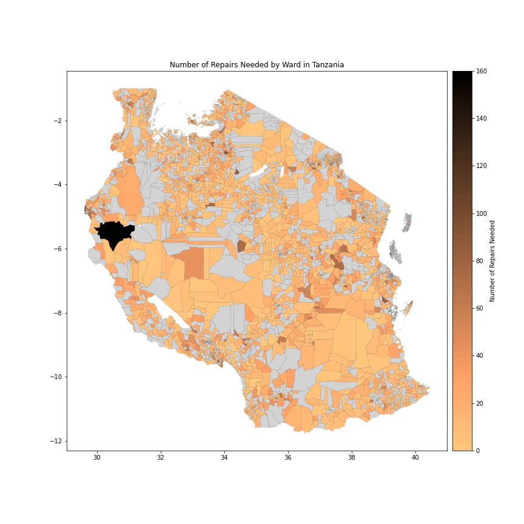
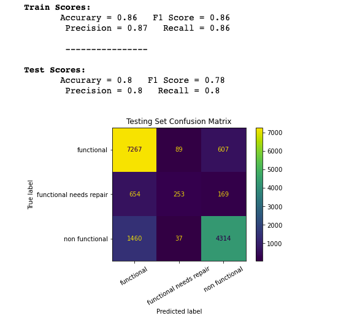

# Tanzanian Waterpoint Functionality Classification

Classifying the working status of waterpoint pumps in Tanzania.

#### By Jonny Hofmeister

This data comes from Taarifa, an open source platform that tracks infrastucture related issues and data, who has sourced this data from the Tanzanian Ministry of Water. It is posted on the [DRIVENDATA](https://www.drivendata.org/competitions/7/pump-it-up-data-mining-the-water-table/page/23/) site as a classification data science contest.

## Summary

This classification and analysis in the follows the CRISP-DM process for data mining. This README provides a brief summary of the project and the results.

### *Task*

In order to better understand waterpoint functionality accross the country, the Tanzanian Ministry of Water would like to build a classification model that predicts the status of waterpoint pumps with unknown functionality. With an accurate model and a more complete understanding of functionality, they can more efficiently address repairs. Further down the road, information from the model can be used help to inform them of patterns of how and why pumps fail.

The image below shows the number of repairs needed for each Ward in Tanzania. Wards without data are shown in gray.

### *Data*

The target in the data we would like to predict is 'status_group' and is reported in three classes - 'functional', 'non functional', and 'functional needs repair'. There is slight class imbalance in the target, functional makes up 54.4% of the rows, non functional and functional needs repair make up 38.4% and 7.2% respectively. The goal is to produce a ternary classification model that can label predict all three status groups. 

Around 40 features are given in the original dataset. They contain numerical information like population, gps position, and total static head, as well as categorical features like region, ward, waterpoint type, quantity, and quality. Many of these features come in pairs that are extremely similar and redundant. The features were trimmed to leave out duplicate types of information, but still encompass all the information given in the dataset. The first models will try to mine insights from all the information before moving on to select certain features determined to be more important.

In processing all the features, a variety of methods were tested and used. Missing values have been imputed or excluded, numerical features scaled, certain categoricals one-hot encoded, and other categoricals frequency encoded. 

### *Modeling*

After creating a baselin model, three differnet machine learning model types were tested. K-Nearest Neighbors, Random Forest, and Support Vector Classifier were all used via the SkLearn package. Some parameter tuning was used with the KNN and Random Forest models and slightly improved performance. 

### *Evaluation and Results*

To evaluate the models, a combination of f1 score and accuracy were used, along with confusion matricies to visualize the results. Here is an example of the results from the best performing Random Forest model:

The random forest performed the best out of the box, and parameter tuning was able to improve scores by about 2%. This model suffered from the most over-fitting, but the tuning was able to improve that as well. The random forest is the model I would move forward with into future iterations. A ceiling was hit with what was capable with parameter tuning, so future iterations will involve refining our feature selection and improving preprocessing techniques like imputation strategies. 

The KNN model performed nearly just as well as the random forest. Parameter tuning did not effect scores much at all, and runtimes were slightly longer than RF but not terrible. While moving forward with training the Random Forest on improved datasets, I would also test the KNN on better data. It performed nearly as well and could end up yeilding better results on better data. An advantage of the KNN model to point out is that it did not over-fit compared to a RF, this is something to consider if over-fitting continues to be an issue in the tree-based model. 

The SVC model performed much worse than the other two, and took significantly longer to train. While accuracy scores were only 5-10% worse than the other models, the SVC completely failed at a ternary classification and predicted zero outcomes in the 'functional needs repair' class. Given this and the runtime issue, I would completely drop this model from future iterations and only move forward with the other two.

### *Moving Forward*

Moving forward with these models means understanding the dataset better and finding which features produce signal and which are just noise. This will be the best way to improve testing accuracy and combat overfitting. 80% accuracy is not a bad starting point, so next steps also involve understanding the Tanzanian Ministry of Water's goals for repair to find how we can help them make actionable decision and best practices for efficienty addressing and repairing non functional waterpoints.

##### **Thanks for reading!**
